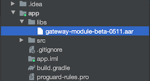

# Gateway Module Android SDK

`Android` SDK for `Geeklink Gateway Module`.

- `Gateway Module`: Serial port module that can add, delete, control and set Geeklink Peripherals through radio frequency communication.

- Official Website: [www.geeklink.com.cn](https://www.geeklink.com.cn)

- 中文帮助手册: [READM_CN.md](README_CN.md)

## Add To Project

1. Add `AAR` file

    

 2. Edit `build.gradle` file
    ```Groovy
    repositories {
        flatDir {
            dirs 'libs'
        }
    }
    ```
    ```Groovy
    dependencies {

        ...

        implementation name: 'gateway-module-beta-0511', ext: 'aar'
    }
    ```
3. Click `Sync Project with Gralde Files` button

    

## Usage

1. Set Serial Port
    ```Java
    GatewayModuleSDK.setSerialPort("/dev/ttyS0");
    ```
2. Set Observer
    ```Java
    GatewayModuleSDK.setObserver(this);
    ```
3. Get Peripheral List
    ```Java
    GatewayModuleSDK.getPeripheralList()
    ```
4. Peripheral List Change
    ```Java
    @Override
    public void onPeripheralListChange() {
        ...
    }
    ```
5. Peripheral State Change
    ```Java
    @Override
    public void onPeripheralStateChange(Byte peripheralId) {
        ...
    }
    ```
6. Peripheral Scan
    ```Java
     new ScanRequestTask(activity, new ScanRequestTask.CallBack() {
        @Override
        public void onResponse(StatusType status, byte peripheralId, PeripheralType peripheralType) {
            ...
        }
    }).execute("");
    ```
7. Peripheral Delete
    ```Java
    new DeleteRequestTask(activity, peripheralInfo.getPeripheralId(), new DeleteRequestTask.CallBack() {
        @Override
        public void onResponse(StatusType status) {
            ...
        }
    }).execute("");
    ```
8. Peripheral Control
    ```Java
    new ControlRequestTask(activity, peripheralInfo.getPeripheralId(), thermostatState, new ControlRequestTask.CallBack() {
        @Override
        public void onResponse(StatusType status) {
            ...
        }
    }).execute("");
    ```

## Catalogue

 - com/geeklink/gateway/module
    - define
        - [CurtainControlType.java](readme/define/CurtainControlType.md) // 窗帘控制类型
        - [PeripheralInfo.java](readme/define/PeripheralInfo.md) // 分机信息
        - [PeripheralType.java](readme/define/PeripheralType.md) // 分机类型
        - [StatusType.java](readme/define/StatusType.md) // 状态类型
        - [SwitchControlInfo.java](readme/define/SwitchControlInfo.md) // 开关控制信息
        - [SwitchControlType.java](readme/define/SwitchControlType.md) // 开关控制类型
        - [ThermostatState.java](readme/define/ThermostatState.md) // 温控面板状态
    - task
        - [ControlRequestTask.java](readme/task/ControlRequestTask.md) // 控制请求
        - [DeleteRequestTask.java](readme/task/DeleteRequestTask.md) // 删除请求
        - [ScanRequestTask.java](readme/task/ScanRequestTask.md) // 扫描添加请求
     - [GatewayModuleSDK.java](readme/GatewayModuleSDK.md) // SDK 接口
