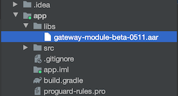

# Gateway Module Android SDK

在 `Android` 上与 `极联网关模块` 的通信 SDK。 

- `网关模块`: 通过射频通信，可以添加，删除，控制，设置极联分机设备的串口模块。

- 官网地址: [www.geeklink.com.cn](https://www.geeklink.com.cn)

- English README: [README.md](README.md)

## 加入工程

1. Add `AAR` file <br/> 将 `AAR` 文件加入工程

    

 2. 在 `build.gradle` 中加入
    ```Groovy
    repositories {
        flatDir {
            dirs 'libs'
        }
    }
    ```
    ```Groovy
    dependencies {

        ...

        implementation name: 'gateway-module-beta-0511', ext: 'aar'
    }
    ```
3. 点击 `Sync Project with Gralde Files` 按钮进行同步

    

## 使用

1. 设置串口路径，根据实际串口路径填写
    ```Java
    GatewayModuleSDK.setSerialPort("/dev/ttyS0");
    ```
2. 设置回调监听
    ```Java
    GatewayModuleSDK.setObserver(this);
    ```
3. 获取分机列表
    ```Java
    GatewayModuleSDK.getPeripheralList()
    ```
4. 分机列表改变
    ```Java
    @Override
    public void onPeripheralListChange() {
        ...
    }
    ```
5. 分机状态改变
    ```Java
    @Override
    public void onPeripheralStateChange(Byte peripheralId) {
        ...
    }
    ```
6. 设备添加
    ```Java
     new ScanRequestTask(activity, new ScanRequestTask.CallBack() {
        @Override
        public void onResponse(StatusType status, byte peripheralId, PeripheralType peripheralType) {
            ...
        }
    }).execute("");
    ```
7. 设备删除
    ```Java
    new DeleteRequestTask(activity, peripheralInfo.getPeripheralId(), new DeleteRequestTask.CallBack() {
        @Override
        public void onResponse(StatusType status) {
            ...
        }
    }).execute("");
    ```
8. 设备控制，这个是控制温控面板的例子
    ```Java
    new ControlRequestTask(activity, peripheralInfo.getPeripheralId(), thermostatState, new ControlRequestTask.CallBack() {
        @Override
        public void onResponse(StatusType status) {
            ...
        }
    }).execute("");
    ```

## 目录
 - com/geeklink/gateway/module
    - define
        - [CurtainControlType.java](readme/define/CurtainControlType.md) // 窗帘控制类型
        - [PeripheralInfo.java](readme/define/PeripheralInfo.md) // 分机信息
        - [PeripheralType.java](readme/define/PeripheralType.md) // 分机类型
        - [StatusType.java](readme/define/StatusType.md) // 状态类型
        - [SwitchControlInfo.java](readme/define/SwitchControlInfo.md) // 开关控制信息
        - [SwitchControlType.java](readme/define/SwitchControlType.md) // 开关控制类型
        - [ThermostatState.java](readme/define/ThermostatState.md) // 温控面板状态
    - task
        - [ControlRequestTask.java](readme/task/ControlRequestTask.md) // 控制请求
        - [DeleteRequestTask.java](readme/task/DeleteRequestTask.md) // 删除请求
        - [ScanRequestTask.java](readme/task/ScanRequestTask.md) // 扫描添加请求
     - [GatewayModuleSDK.java](readme/GatewayModuleSDK.md) // SDK 接口
